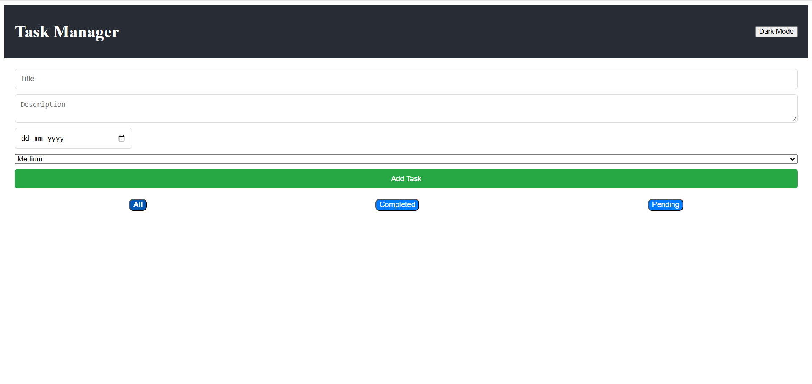
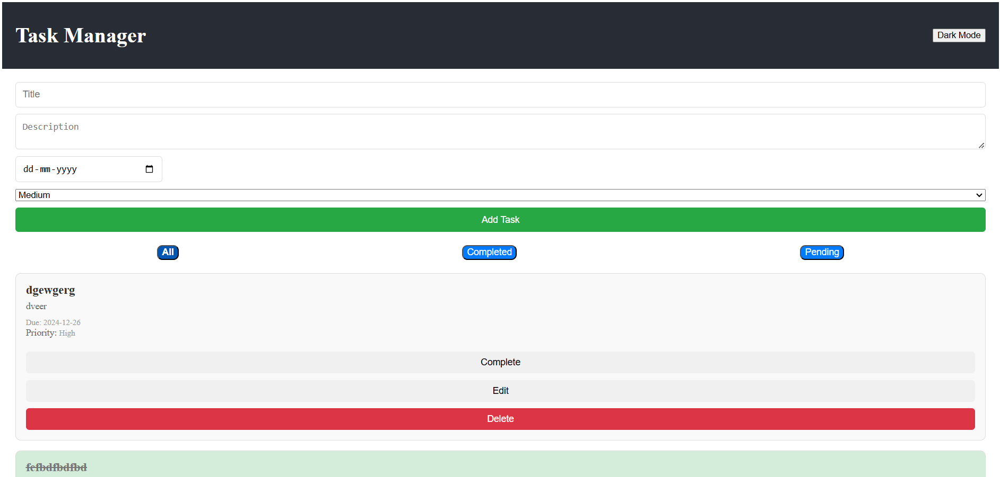
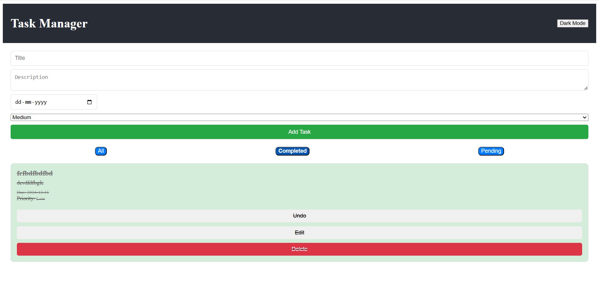
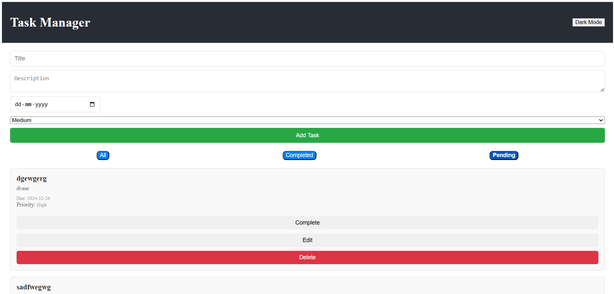

# To-Do

Features

1. Add Task: Users can add new tasks with a title, description, due date, and priority.
2. Edit Task: Users can edit existing tasks.
3. Delete Task: Users can delete tasks they no longer need.
4. Complete/Undo Task: Users can mark tasks as completed or undo them.
5. Filter Tasks: Tasks can be filtered based on their status (All, Completed, Pending).
6. Dark Mode: Toggle between light and dark modes for a better user experience.
7. Persistent Storage: Tasks and dark mode preference are saved in localStorage, so data persists even after the page is refreshed.

Here’s a sample README.md file for your project that explains how to set up and run the app, along with any additional features you have implemented:

To Do App
A simple task management app built with React that allows users to add, edit, delete, and filter tasks. Users can also mark tasks as completed and toggle between dark and light modes.

Features
Add Task: Users can add new tasks with a title, description, due date, and priority.
Edit Task: Users can edit existing tasks.
Delete Task: Users can delete tasks they no longer need.
Complete/Undo Task: Users can mark tasks as completed or undo them.
Filter Tasks: Tasks can be filtered based on their status (All, Completed, Pending).
Dark Mode: Toggle between light and dark modes for a better user experience.
Persistent Storage: Tasks and dark mode preference are saved in localStorage, so data persists even after the page is refreshed.

How to Set Up and Run the App

1. Create a new repository.
2. Create a folder in desktop.
3. Open the colder using command prompt(cmd).
4. Copy the url of that repository.
5. Then type git clone "url".
6. then successfully git will be initialized.
7. Open it in vs code using commad in command prompt "code ."
8. NaNavigate to the project directory.
9. Install the dependencies using npm install.
10. Run the app locally using npm start.

This will start the development server, and you can view the app in your browser at http://localhost:3000.

Folder Structure

public/: Contains static files like index.html and images.
src/: Contains the React components and logic.
components/: Contains individual components like TaskForm, TaskCard, TaskList, and Header.
App.js: The main application component that handles the task logic, including adding, editing, and deleting tasks.
TaskForm.js: The form used to add and edit tasks.
TaskCard.js: A component for displaying individual tasks.
FilterBar.js: A component for filtering tasks by status.

Future Enhancements

User Authentication: Implement user login/signup functionality to save tasks for individual users.
Task Deadline Notifications: Add notifications for upcoming task deadlines.
Task Prioritization: Introduce more advanced task prioritization with sorting options

Screenshots

